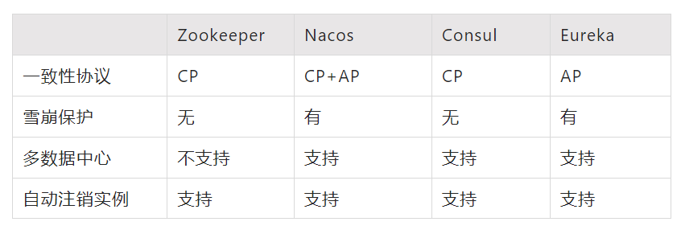
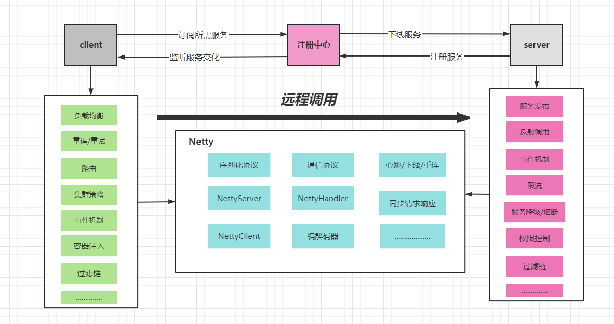
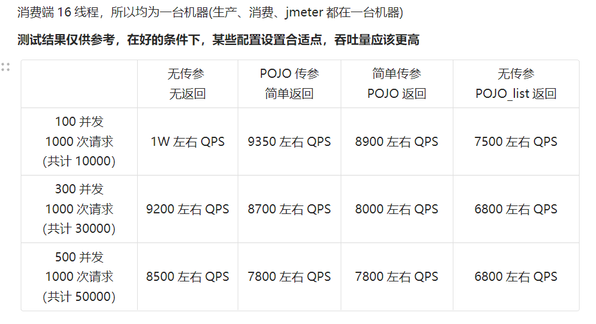

## 简介
### **什么是RPC**

RPC（Remote Procedure Call）远程过程调用，简言之就是像调用本地方法一样调用远程服务。目前外界使用较多的有gRPC、Dubbo、Spring Cloud等。相信大家对RPC的概念都已经很熟悉了，这里不做过多介绍。

### 为啥要自己写

为什么要自己写一个RPC框架，dubbo难道满足不了？我觉得从个人成长上说，如果一个程序员能清楚的了解RPC框架所具备的要素，掌握RPC框架中涉及的服务注册发现、负载均衡、序列化协议、RPC通信协议、Socket通信、异步调用、熔断降级等技术，可以全方位的提升基本素质。虽然也有相关源码，但是只看源码容易眼高手低，动手写一个才是自己真正掌握这门技术的最优路径。（换个角度想想dubbo真的适合你们项目吗？有多少人觉得dubbo只是比feign性能好，更主流，大公司都用等等理由才用的？）

## **RPC框架要素**

一款分布式RPC框架离不开三个基本要素：

- 服务提供方 Serivce Provider
- 服务消费方 Servce Consumer
- 注册中心 Registery

围绕上面三个基本要素可以进一步扩展服务路由、负载均衡、服务熔断降级、序列化协议、通信协议等等。

1. **注册中心**

    主要是用来完成服务注册和发现的工作。虽然服务调用是服务消费方直接发向服务提供方的，但是现在服务都是集群部署，服务的提供者数量也是动态变化的，所以服务的地址也就无法预先确定。因此如何发现这些服务就需要一个统一注册中心来承载。
2. **服务提供方（RPC服务端）**

    其需要对外提供服务接口，它需要在应用启动时连接注册中心，将服务名及其服务元数据发往注册中心。同时需要提供服务服务下线的机制。需要维护服务名和真正服务地址映射。服务端还需要启动Socket服务监听客户端请求。
3. **服务消费方（RPC客户端）**

    客户端需要有从注册中心获取服务的基本能力，它需要在应用启动时，扫描依赖的RPC服务，并为其生成代理调用对象，同时从注册中心拉取服务元数据存入本地缓存，然后发起监听各服务的变动做到及时更新缓存。在发起服务调用时，通过代理调用对象，从本地缓存中获取服务地址列表，然后选择一种负载均衡策略筛选出一个目标地址发起调用。调用时会对请求数据进行序列化，并采用一种约定的通信协议进行socket通信。

## **技术选型**

### 注册中心

目前成熟的注册中心有Zookeeper，Nacos，Consul，Eureka，它们的主要比较如下：

我们这里采用nacos

### IO通信框架 

本实现采用Netty作为底层通信框架，Netty是一个高性能事件驱动型的非阻塞的IO(NIO)框架。

### 通信协议

TCP通信过程中会根据TCP缓冲区的实际情况进行包的划分，所以在业务上认为一个完整的包可能会被TCP拆分成多个包进行发送，也有可能把多个小的包封装成一个大的数据包发送，这就是所谓的TCP粘包和拆包问题。所以需要对发送的数据包封装到一种通信协议里。

业界的主流协议的解决方案可以归纳如下：

1. 消息定长，例如每个报文的大小为固定长度100字节，如果不够用空格补足。
2. 在包尾特殊结束符进行分割。
3. 将消息分为消息头和消息体，消息头中包含表示消息总长度（或者消息体长度）的字段。

很明显1，2都有些局限性，本实现采用方案3，**自定义协议**

### 序列化协议

常见的协议有JavaSerializer、json、Protobuf及Hessian。建议选用Protobuf，其序列化后码流小性能高，非常适合RPC调用，Google自家的gRPC也是用其作为通信协议。但是我们这里采用**Hessian2**序列化（懒，其他后续慢慢实现）

## 整体架构

## 压测结果

## 项目目录说明
├─easy-rpc-common  	：  公共包

├─easy-rpc-core		：	核心包	

├─easy-rpc-remote	：	netty相关通信

├─easy-rpc-sdk		： 	spring相关

├─easy-rpc-test		：	测试工程

## 使用说明
见测试工程

设计思路见： [从0-1手写RPC框架](https://returnac.cn/pages/frame/netty/%E4%BB%8E0-1%E6%89%8B%E5%86%99RPC%E6%A1%86%E6%9E%B6.html)

## 持续更新中！！！
目前只是基本雏形，很多功能都还没有，后续拓展见架构功能图
